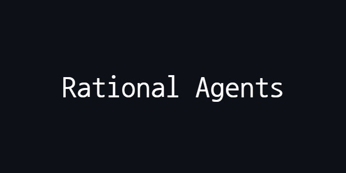

<p align="center">
  
</p>

## Overview
- This project involves the implementation of four rational agents, each following a different architecture
- The agents' primary objective is to collect items scattered across an environment and bring them back to their starting location
- Built with Python

<p>This project was developed during my Artificial Intelligence course in college.

## Problem Description

### Environment
<p>The environment is a 20x20 grid where the agent starts at position (1,1), which is also the location where the collected items must be dropped off.

### Items
<p>Five items of each type are randomly placed in the environment.
<p>There are two types of items scattered randomly within the environment:

- **Item Type 1**: Worth 10 points
- **Item Type 2**: Worth 20 points

### Agents Actions
<p>The agents have the following actions they can perform:

- Move Left
- Move Right
- Move Up
- Move Down
- Pick Up Item
- Drop Item
- NoOp (No Operation)

### Agents Perceptions
<p>The agents have the following perceptions:

- Their current location
- The content of the current location
- The starting location

### Scoring System
<p>The agents are evaluated based on the time taken to collect all items and the total points accumulated from the items collected.

## Implemented Agents
1. Simple Reactive Agent
- Moves in random directions
- If it encounters an item, it picks it up and returns it to the starting position

2. Model-Based/State-Based Agent
- Maintains an internal map of places it has visited and avoids revisiting the same paths
- If it finds an item, it picks it up and returns it to the starting position

3. Goal-Based Agent
- Knows the locations of the items on the map
- Moves towards the nearest items using the shortest possible path

5. Utility-Based Agent
- Knows the locations of the items on the map
- Moves towards the nearest items using the shortest possible path
- Prioritizes collecting items of higher value first

## Installation and Usage
To compile and run this project, follow these steps:
1. Install Python
2. Clone the repository:
   ```bash
   git clone https://github.com/GiuliaFreulon/rational-agents
   cd rational-agents
3. Run the program:
   ```bash
   python main.py

## License
This project is licensed under the MIT License. See the [LICENSE](LICENSE) file for details.
